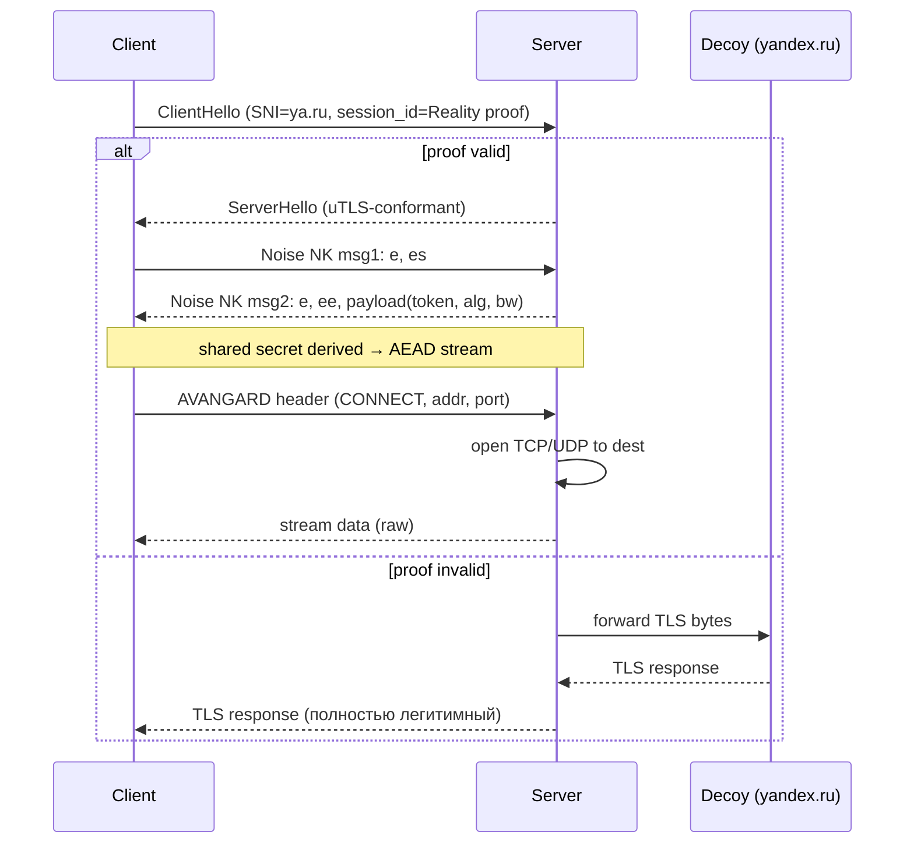
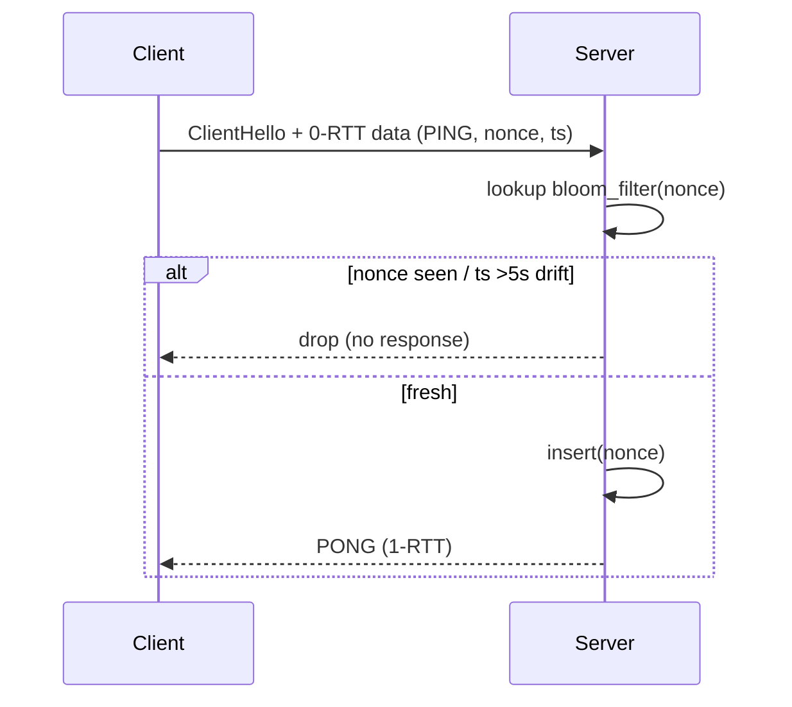

# AVANGARD Protocol — Полная техническая спецификация

> RFC-style design document, v0.1-draft
> Гибридный протокол: Hysteria2 (скорость) × VLESS+Reality (маскировка) + RegionShield
> Триада: **БЫСТРО · БЕЗОПАСНО · ПРОСТО**

---

## TL;DR

AVANGARD — это транспортный туннельный протокол с **двумя физическими носителями** (QUIC/UDP по умолчанию + TLS 1.3/TCP как fallback), **аутентификацией по Noise NK поверх QUIC**, **нулевыми заголовками VLESS-стиля** и **Reality-подобной маскировкой SNI** через криптографическую привязку к реальному decoy-домену. Поверх ядра построен модуль **RegionShield**, который автоматически выбирает из 5 транспортных режимов (Yandex CDN Clone, Госуслуги WS, SplitDPI, QUIC Camouflage, DNS Tunnel) и подкручивает параметры под конкретного ISP (МТС/Билайн/Мегафон/…).

---

## Содержание

1. [Блок 1. Архитектура ядра](#блок-1)
2. [Блок 2. Threat Model](#блок-2)
3. [Блок 3. Производительность](#блок-3)
4. [Блок 4. UX](#блок-4)
5. [Блок 5. Стек реализации](#блок-5)
6. [Блок 6. RegionShield](#блок-6)
7. [Блок 7. Deliverables (сравнения, roadmap, trade-offs, ISP-карта, установка relay, тест-план, юр. дисклеймер)](#блок-7)

---

<a id="блок-1"></a>
# БЛОК 1. Архитектура ядра (Core Protocol)

## 1.1 Слоистая модель

```
┌──────────────────────────────────────────────────────────┐
│  Application: SOCKS5 / HTTP / TUN-интерфейс              │
├──────────────────────────────────────────────────────────┤
│  AVANGARD framing (≤32-byte header, VLESS-style)         │
├──────────────────────────────────────────────────────────┤
│  Stream mux:                                             │
│    QUIC streams (нативно)   |   SMUX v2 (TCP fallback)   │
├──────────────────────────────────────────────────────────┤
│  Crypto session: Noise_NK_25519_ChaChaPoly_BLAKE2s       │
│                  (или AES-GCM при AES-NI)                │
├──────────────────────────────────────────────────────────┤
│  Маскировка: Reality-SNI-binding + uTLS (JA3/JA4 spoof)  │
├──────────────────────────────────────────────────────────┤
│  Транспорт:  QUIC v1 (RFC 9000) / TLS 1.3 over TCP       │
│              + RegionShield-режимы (A..E)                │
├──────────────────────────────────────────────────────────┤
│  Сеть:       UDP/443 (default) | TCP/443 | TCP/8443/...  │
└──────────────────────────────────────────────────────────┘
```

Ключевая идея — **разделить три ответственности**:
- *шифрование данных* делает Noise (после handshake это просто AEAD-stream),
- *маскировку* делает уTLS+Reality на уровне ClientHello,
- *доставку* делает QUIC или TCP-mux.

Это даёт независимое развитие каждого слоя и позволяет менять, например, обфускацию без ломания крипто-ядра.

## 1.2 Транспортный слой

### 1.2.1 Основной транспорт — QUIC

- Базовый стандарт: **RFC 9000 (QUIC v1)** + RFC 9001 (TLS) + RFC 9002 (loss detection).
- Реализация: форк **quic-go** с патчами:
  - кастомный `Initial Packet` payload (рандомизация/мимикрия GQUIC),
  - произвольный ALPN,
  - hook на `cryptoSetup` для подмены TLS-стека на uTLS.
- Multipath: **RFC 9440 (QUIC-MP)** — позволяет отправлять данные одной сессии через Wi-Fi и LTE одновременно, склеивая bandwidth.
- Congestion control: **BBR v3** как дефолт, опционально CUBIC для совместимости.
- 0-RTT: включён, но с защитой от replay (см. §2.A).

### 1.2.2 Fallback — TLS 1.3 over TCP

Триггеры переключения на TCP-fallback:
1. UDP/443 не отвечает в течение **800 мс** на 3 SYN-эквивалента (Initial+Retry).
2. После handshake потери QUIC > 15 % за 5 секунд.
3. RTT QUIC vs RTT TCP-эталона различается в > 3 раза → ТСПУ замедляет UDP.

Решение принимает **Adaptive Transport Selector (ATS)**:

```
choose_transport(probe_result):
    if udp_443_works and rtt < 50ms and loss < 5%:        return QUIC
    if udp_443_works and rtt < 200ms and loss < 15%:      return QUIC
    if tcp_443_works:                                     return TCP-TLS
    if tcp_8443/2053/2087 works:                          return TCP-TLS-altport
    return REGION_PROFILE_DECISION   # передать RegionShield
```

### 1.2.3 0-RTT с anti-replay

- Сервер хранит **bloom filter** на nonce из Noise PSK с окном ±5 секунд (см. §2.A).
- Клиент в 0-RTT шлёт только **идемпотентные** payloads (`PING`, `RESOLVE`). Все `CONNECT` идут через 1-RTT первый раз.

## 1.3 Маскировка и антидетект (улучшенный Reality)

### 1.3.1 Reality-SNI-binding 2.0

Классический Reality использует X25519 ECDH между клиентом и сервером поверх TLS-ClientHello, чтобы decoy-сервер не смог различить «настоящего» клиента и пробу цензора. AVANGARD расширяет схему:

```
client_hello.SNI = decoy_domain   (например, www.yandex.ru)
client_hello.key_share = X25519(client_pk)
client_hello.session_id = enc_with_decoy_pk(  # 32 байта
        flag = 0x41 ("A"),
        timestamp,
        proof = HKDF(ECDH(client_sk, server_pk), "avangard-v1")
)
```

- Пакеты, не прошедшие проверку proof, **прозрачно проксируются** на реальный decoy (`www.yandex.ru:443`), и клиент-цензор получает легитимный TLS от Яндекса с валидным сертификатом.
- Если же proof валиден — сервер выходит из «прокси-в-decoy» и инициирует Noise-handshake внутри обычного TLS application data.

### 1.3.2 Динамический JA3/JA4

- Сборщик `fp-harvester`: каждые **4 часа** делает реальные TLS-handshakes к топ-100 RU/IR/CN сайтов (Cloudflare, Akamai, Fastly, Yandex CDN, ArvanCloud) и сохраняет fingerprints.
- Клиент при старте подтягивает JSON `fingerprints.json` (signed Ed25519) и выбирает FP, релевантный текущему ОС/браузерному окружению (Win10 ≠ Android ≠ macOS).
- Реализация: **uTLS-fork** с поддержкой JA4 (стандартный uTLS пока только JA3) и параметризованным расширением `ECH/GREASE`.

### 1.3.3 Padding-рандомизация

- Каждый AVANGARD-фрейм добавляет padding `len ∈ U[0..256]` с интервалом отправки `jitter ∈ U[1..8] мс` (для интерактивных потоков отключается).
- Размер итогового UDP-датаграма выровнен под 1200/1280/1500 (популярные MTU), чтобы статистический анализатор видел распределение, идентичное обычному QUIC.

### 1.3.4 Certificate Transparency

- Сервер обязателен **с сертификатом из Let's Encrypt / ZeroSSL**, реально выписанным на decoy-домен (через ACME DNS-01 challenge).
- При запуске установщика проверяется наличие записи в **CT-логе** (`ct.googleapis.com/logs`). Если нет — установка прерывается (защита от self-signed «палева»).

## 1.4 Аутентификация и шифрование

### 1.4.1 Noise NK поверх QUIC

Выбран паттерн **Noise_NK_25519_ChaChaPoly_BLAKE2s** (RFC-noise §7.5).

Почему NK, а не XX:
- Сервер pre-shared (TOFU pinning hash в URI клиента), клиент анонимен → нам не нужен mutual auth с сертификатами; токен ≠ identity.
- 1-RTT, минимум сообщений: `e, es` → `e, ee` (2 сообщения, 1 RTT).
- Меньше метаданных в эфире, чем у XX.

Полный поток:

```
Client                                      Server
------                                      ------
ClientHello (uTLS, decoy SNI)
    └─ session_id = Reality proof + e_pub
                                  --------->
                                            verify proof:
                                              valid → Noise mode
                                              invalid → forward to decoy

           Noise message 1: e, es
                                  --------->
                                            decrypt → derive ck

           Noise message 2: e, ee, payload(token, alg_pref)
                                  <---------

after handshake: ChaCha20-Poly1305 / AES-256-GCM stream
```

### 1.4.2 Токены доступа

- Формат: `Ed25519(JSON{sub, iat, exp, scope}).b64url` — **не путать с AVANGARD-token внутри framing** (тот короче, 16 байт).
- TTL **1 час**, ротация через side-channel: HTTPS-эндпойнт `/v1/token/rotate` на том же сервере (но отдельный ALPN), вызывается клиентом за 5 мин до истечения.
- HMAC-привязка: в AVANGARD-фрейме передаётся не сам UUID, а `HMAC-BLAKE2s(token, session_nonce)[:16]`.

### 1.4.3 Шифрование payload

| Платформа           | AEAD                  | Причина                        |
|---------------------|-----------------------|--------------------------------|
| Mobile (ARM)        | ChaCha20-Poly1305     | Software-friendly, низкий power|
| Desktop x86 (AES-NI)| AES-256-GCM           | Аппаратное ускорение           |
| Server              | AES-256-GCM (default) | AES-NI/VAES повсеместно        |

Выбор согласовывается в Noise message 2 (`alg_pref`), сервер уважает топ-1 предпочтение клиента, но имеет право даунгрейдить **только** до ChaCha20 (никогда — до старых наборов).

### 1.4.4 PFS

- Каждая Noise-сессия использует свежие `e_priv/e_pub` (X25519).
- Static-key компромисс не раскрывает прошлые сессии (NK-pattern даёт PFS после первого `ee`).
- Re-keying каждые **4 ГБ** или **30 минут** — что наступит раньше (RFC 9001 §6.6 совместимо).

### 1.4.5 Двойного шифрования НЕТ

QUIC и так шифрует pkt header keys + payload. Накладывать сверху ещё один TLS — **+15-20% CPU без выгоды**, а fingerprint становится только заметнее. Reality-SNI-binding уже даёт нужную маскировку.

## 1.5 Протокольный слой (header)

### 1.5.1 Формат заголовка

После Noise-handshake первый фрейм клиента — **AVANGARD Request Header**, ≤ 32 байт:

```
 0                   1                   2                   3
 0 1 2 3 4 5 6 7 8 9 0 1 2 3 4 5 6 7 8 9 0 1 2 3 4 5 6 7 8 9 0 1
+-+-+-+-+-+-+-+-+-+-+-+-+-+-+-+-+-+-+-+-+-+-+-+-+-+-+-+-+-+-+-+-+
|  ver  |              token_hmac (16 bytes)                    |
+-+-+-+-+                                                       +
|                                                               |
+                                                               +
|                                                               |
+               +-+-+-+-+-+-+-+-+-+-+-+-+-+-+-+-+-+-+-+-+-+-+-+-+
|               |  cmd  |  atyp |    addr (variable)         ...
+-+-+-+-+-+-+-+-+-+-+-+-+-+-+-+-+
                                |             port              |
                                +-+-+-+-+-+-+-+-+-+-+-+-+-+-+-+-+
```

- `ver` (2 bits) — текущая `0b01`.
- `token_hmac` (16 bytes) — HMAC-производная от UUID.
- `cmd` (4 bits): `0x1=CONNECT`, `0x2=UDP_ASSOCIATE`, `0x3=PING`, `0x4=BIND` (reserved).
- `atyp` (4 bits): `0x1=IPv4`, `0x4=IPv6`, `0x3=DOMAIN` (с 1-байтовым префиксом длины).
- `addr` (variable, ≤ 255 + 1).
- `port` (16 bits, network byte order).

После заголовка — **сырой stream-data** без длины (длина = квик-стрим), как в VLESS.

### 1.5.2 Команды

| cmd  | Имя            | Семантика                                    |
|------|----------------|----------------------------------------------|
| 0x1  | CONNECT        | TCP-туннель к (addr,port)                    |
| 0x2  | UDP_ASSOCIATE  | UDP-релей; следующий уровень шлёт UDP-фреймы |
| 0x3  | PING           | Heartbeat (см. §1.6.2)                       |
| 0x4  | BIND           | Reverse-tunnel (resv для v2)                 |

### 1.5.3 Мультиплексирование

- **QUIC-режим:** один поток QUIC = один tunnel-stream. Никакого собственного mux'а — наследуем от QUIC.
- **TCP-fallback:** SMUX v2 поверх единого TLS-соединения.
  - max concurrent streams: 256;
  - flow-control window: 4 МБ per-stream, 16 МБ session;
  - frame: `[2b len][1b type][1b stream_id_high][1b stream_id_low][payload]`.

## 1.6 Управление соединением

### 1.6.1 Connection Migration

- QUIC `Connection ID` (8 байт) сохраняется при смене IP клиента.
- Path validation per RFC 9000 §8.2 (PATH_CHALLENGE/PATH_RESPONSE).
- **Anti-amplification**: сервер ограничивает 3× от полученных байт до валидации пути.

### 1.6.2 Heartbeat

- `PING` (cmd=0x3) каждые **30 сек** без ответа → 3 ретрая → разрыв сессии.
- `idle_timeout = 120 сек`. Меньше → лишние коннекты, больше → токен-ротация ломается.

### 1.6.3 Bandwidth estimation (Hysteria2-style)

В Noise-handshake message 2 сервер передаёт:

```
{
  "max_upload":   "200 Mbps",
  "max_download": "1 Gbps"
}
```

Клиент использует эти значения как **floor** для BBR's pacing rate. Это даёт Hysteria2-эффект: BBR ramp-up за < 1 RTT.

### 1.6.4 Приоритизация

QUIC stream priority (RFC 9218) + локальная очередь `intr / bulk`:

| Категория         | Признак                               | Приоритет |
|-------------------|---------------------------------------|-----------|
| Interactive       | dst-port ∈ {22, 5060-5061, RTP-range} | 0 (high)  |
| DNS               | dst-port = 53                         | 1         |
| Default web       | dst-port ∈ {80, 443}                  | 2         |
| Bulk              | size > 1 МБ или torrent-эвристика     | 3 (low)   |

## 1.7 State machine (клиент)

```
              +-------+
              |  IDLE |
              +---+---+
                  | start()
                  v
            +-----+-----+      probe fail (всё)
            | AUTOPROBE |---------------------+
            +-----+-----+                     |
                  |                            v
                  | mode = A..E       +-----------------+
                  v                   |   REGION_FAIL   |
            +-----+-----+             | (DNS Tunnel E)  |
            | HANDSHAKE |             +-----------------+
            +-----+-----+
       success / |  | replay reject
                 v  v
            +-----+-----+    migrate    +----------+
            |  ACTIVE   |<------------->| MIGRATING|
            +-----+-----+               +----------+
                  | idle 120s / err
                  v
            +-----+-----+
            |  CLOSED   |
            +-----------+
```

## 1.8 State machine (сервер)

```
LISTEN → (recv ClientHello)
       ├─ proof valid     → NOISE_PEND → ACTIVE → CLOSED
       ├─ proof invalid   → DECOY_FORWARD (стрим к ya.ru:443) → CLOSED
       └─ rate-limit hit  → DROP (без RST)
```

---

<a id="блок-2"></a>
# БЛОК 2. Безопасность — Threat Model

## 2.1 STRIDE-анализ

| Компонент           | S | T | R | I | D | E | Контрмера                                            |
|---------------------|---|---|---|---|---|---|------------------------------------------------------|
| Reality handshake   | ● | ● |   | ● |   |   | proof-of-knowledge X25519, decoy-forward             |
| Noise NK            | ● | ● |   | ● |   |   | PFS, rekey 30 мин/4 ГБ                               |
| Token (UUID/JWT)    | ● |   |   | ● |   | ● | HMAC-only on wire, ротация 1ч, rate-limit            |
| 0-RTT               |   |   | ● |   |   |   | bloom filter ±5 сек, idempotent commands only        |
| Server endpoint     | ● |   |   | ● | ● |   | ban на 10 мин, auto IP-cycle                         |
| Update channel      | ● | ● |   |   |   | ● | Ed25519 signed updates, pinned root key              |
| Relay (RU)          | ● |   |   | ● | ● |   | RAM-only state, FDE+remote unseal                    |
| QUIC Initial pkt    |   | ● |   | ● |   |   | Mimicry GQUIC/Cloudflare, padding randomization      |

## 2.2 Detail-таблица угроз и митигаций

### A. Replay на 0-RTT
- **Вектор:** цензор перехватывает 0-RTT Initial и переотправляет.
- **Митигация:** server-side **bloom filter (m=2^28, k=7, FPR ≈ 10⁻⁶)** на nonce `(client_id ‖ ts)`; окно ±5 сек, шардирование по 1-сек-buckets, ротация. 0-RTT разрешён только для `PING`/`RESOLVE`.
- **Тест:** Wireshark capture → запуск `replay_attack.py` (10k повторов) → метрика «accepted=0».
- **Probability:** medium (доступно цензору). **Severity:** medium.

### B. Active Probing (GFW/ТСПУ)
- **Вектор:** массовое сканирование IP с попыткой TLS handshake к 443.
- **Митигация:** Reality-style decoy-forward — невалидные ClientHello прозрачно проксируются к `decoy:443`, цензор получает легитимный сертификат и страницу.
- **Тест:** имитатор GFW (Go-script с 1000 случайных handshake) → метрика «100 % нормальных HTTPS-ответов от decoy».
- **Probability:** high. **Severity:** high.

### C. Traffic Correlation / Timing
- **Вектор:** глобальный пассивный наблюдатель сопоставляет timing in/out.
- **Митигация:** **jitter 5–50 мс** на не-интерактивных потоках, padding до MTU-кратного значения, batched-flush через GSO.
- **Тест:** mahimahi-сценарий + correlation-coefficient calculator (Pearson < 0.2).
- **Probability:** low (нужен глобальный наблюдатель). **Severity:** high.

### D. UUID brute / token leak
- **Вектор:** перебор UUID4.
- **Митигация:** на wire — только HMAC-производная; rate-limit 5 неудач/IP → 10 мин ban; sliding window счётчик в Redis.
- **Тест:** `hydra`-style brute → метрика «ban triggered ≤ 6 attempts».

### E. DPI по QUIC fingerprint
- **Вектор:** Hysteria2 имеет узнаваемый Initial Packet (фиксированный размер, специфичные frame-type).
- **Митигация:** рандомизация размера Initial Packet ∈ {1200, 1252, 1280, 1452}, ALPN из пула {`h3`, `h3-29`, `h3-32`, `doq`, `smb`}, Connection ID из реального CID-распределения Chrome.
- **Тест:** `nDPI` 4.10 + `wfc-classifier` → должен детектить как «UNKNOWN» или «QUIC-google».

### F. Server side-channel
- **Вектор:** различие в ответах сервера между авторизованным и неавторизованным клиентом.
- **Митигация:**
  - все ошибки → локальный лог;
  - клиенту всегда `generic_timeout` (RST после рандомного 30-300 мс);
  - decoy-forward на невалидных handshake;
  - запрет `traceroute`-friendly TTL (всегда 64).
- **Тест:** comparison-test на 10k probe (валид/невалид) → t-test p-value > 0.05.

### G. Supply chain
- **Митигация:** ≤ 5 внешних либ (`quic-go-fork`, `utls-fork`, `flynn/noise`, `golang.org/x/crypto`, `github.com/cloudflare/circl`); reproducible builds через `gozip`/`-trimpath -buildvcs=false`; SBOM в CycloneDX, публикация в Sigstore Rekor.
- **Тест:** CI step `verify-reproducibility.sh` сравнивает 3 независимых сборки.

### H. Key compromise
- **Митигация:**
  - Ed25519 keypair ротация **каждые 7 дней**, перекрытие 24ч (старый и новый ключ оба валидны);
  - TOFU: при первом подключении клиент пиннит `pubkey_hash`, дальнейшие изменения требуют подписи **старым** ключом;
  - HSM/TPM-storage опционально на сервере.
- **Тест:** `key-rotation-sim.sh`: эмулирует 30 дней работы, проверяет 0 потерь сессий при ротации.

## 2.3 Out of scope (явно)

- **Анонимность пользователя** на уровне Tor (3-hop). AVANGARD — **anti-censorship**, не **anti-traffic-analysis** глобального уровня. Для anonymity → совмещать с Tor.
- **Защита от endpoint-malware** на устройстве клиента.
- **Отказ от логов на стороне ОС** (нужен AppArmor/SELinux profile, отдельный документ).

---

<a id="блок-3"></a>
# БЛОК 3. Производительность

## 3.1 Целевые метрики

| Метрика                  | Цель              | Условия                                      |
|--------------------------|-------------------|----------------------------------------------|
| Handshake (1-RTT)        | ≤ 100 мс          | RTT_link ≤ 80 мс                             |
| Handshake (0-RTT)        | ≤ 20 мс           | RTT_link ≤ 15 мс                             |
| Throughput               | ≥ 90 % канала     | loss ≤ 15 %, RTT ≤ 200 мс                    |
| CPU @ 1 Gbps             | ≤ 5 %             | x86_64, AES-NI, Linux 6.x, io_uring          |
| Concurrent connections   | ≥ 50 000 / core   | persistent idle, heartbeat 30 s              |
| Memory per connection    | ≤ 8 KB steady     | без активного трафика                        |
| Cold start (binary)      | ≤ 200 мс          | до первого `accept()`                        |

## 3.2 Оптимизации

| Техника              | Платформа       | Эффект                              |
|----------------------|-----------------|-------------------------------------|
| `io_uring` (SQPOLL)  | Linux 5.11+     | -40 % syscall/s vs epoll            |
| `kqueue + udp_kqueue`| FreeBSD 13+     | паритет с io_uring                  |
| GSO (UDP_SEGMENT)    | Linux 4.18+     | +60 % UDP throughput                |
| GRO (recvmmsg)       | Linux           | -30 % CPU @ rx                      |
| `sendfile`/`splice`  | Linux           | zero-copy для CONNECT-mode          |
| Goroutines, per-conn | Go              | м/н ≈ 2 KB stack vs OS thread 2 MB  |
| `sync.Pool` для bufs | Go              | -50 % GC pressure                   |
| AES-NI / VAES        | x86_64          | 5–10 GB/s AES-GCM                   |
| ChaCha20 ASM         | ARM64           | ~3 GB/s NEON                        |
| Lock-free queues     | -               | приоритизация без mutex             |

## 3.3 Бенчмарк-стенд (рекомендация)

```
client (Linux, 8 cores, 10 Gbps NIC)  ─┐
                                       ├── netem(loss=10%, rtt=80ms) ── server
client-iperf3 / wrk2 / hyperfine      ─┘
```

CI gate: regression > 5 % → блокировка merge.

---

<a id="блок-4"></a>
# БЛОК 4. UX (Простота подключения)

## 4.1 Установщик

```bash
curl -fsSL https://avangard.sh | bash
```

Что происходит:
1. detect OS/arch → скачать релевантный бинарь (signed Sigstore).
2. сгенерировать UUID, Ed25519 keypair, X25519 server static key.
3. подобрать decoy-домен из локального whitelist (или принять флаг `--decoy=`).
4. выписать Let's Encrypt сертификат (HTTP-01 / DNS-01 — авто).
5. создать systemd unit `avangard.service`.
6. вывести URI и QR-код в терминал.

Флаги:
- `--non-interactive` — для CI;
- `--region=RU/IR/CN/...` — преднастройка профиля RegionShield;
- `--port=443/8443/...`;
- `--no-webui`.

## 4.2 URI-формат

```
avangard://<uuid>@<host>:<port>?
            sni=<decoy>&
            fp=<fingerprint_id>&
            mode=auto|A|B|C|D|E&
            region=auto|RU|IR|CN|...&
            pk=<server_x25519_pub_b64>&
            tofu=<sha256_hex>
            #<name>
```

QR-код в CLI:
```
avangard config qr [--profile=default]
```

## 4.3 Клиентский YAML-конфиг

```yaml
server:
  uri: avangard://...
  tofu: sha256-...

transport:
  preferred: auto       # auto|quic|tcp
  ports: [443, 8443, 2053, 2087, 2096]

regionshield:
  enabled: true
  region: auto
  fallback_chain: [yandex_cdn, splitdpi, gosuslugi_ws, dns_tunnel]

routing:
  bypass_lan: true
  rule_files:
    - geosite:cn
    - geoip:private
  default: proxy

logging:
  level: info
  file: /var/log/avangard.log
  redact_sni: true
```

При старте — JSON-schema валидация; ошибки выводятся с указанием строки.

## 4.4 GUI / web-панель

| Платформа     | Стек                                       |
|---------------|--------------------------------------------|
| Windows / macOS | Wails (Go + WebView)                     |
| Linux desktop | GTK4 (gotk4)                               |
| Android       | Kotlin Multiplatform + JNI к Go           |
| iOS           | KMP + NetworkExtension (Swift wrapper)    |
| CLI           | `avangard` бинарь (cobra)                  |
| Веб-дашборд   | embedded-Go (`net/http` + htmx) on :8443   |

Веб-дашборд:
- live-trafic graph (websocket)
- сессии (UUID-маска, IP-маска, мб/с)
- ротация ключей, скачивание новых URI
- логи (только последние N MB, scrub IP)

---

<a id="блок-5"></a>
# БЛОК 5. Стек реализации

| Слой           | Выбор                                | Альтернатива              |
|----------------|--------------------------------------|---------------------------|
| Server lang    | Go 1.22+                             | Rust (для v2)             |
| Mobile         | Kotlin Multiplatform                 | Flutter                   |
| QUIC           | quic-go-avangard fork                | quiche (Cloudflare, Rust) |
| TLS            | uTLS-avangard fork (+JA4)            | rustls + extension        |
| Crypto         | golang.org/x/crypto, cloudflare/circl| -                         |
| Noise          | flynn/noise (или собственный pkg)    | own (audited)             |
| Mux (TCP)      | own SMUX v2                          | yamux                     |
| Cert ACME      | go-acme/lego                         | certmagic                 |
| Config         | spf13/viper (yaml)                   | koanf                     |
| Logging        | log/slog (Go 1.21+)                  | -                         |

Принцип: **≤ 5 внешних либ верхнего уровня**, всё остальное — std.

---

<a id="блок-6"></a>
# БЛОК 6. RegionShield

## 6.1 Общая архитектура модуля

```
                     ┌─────────────────────────────────┐
                     │       RegionShield Engine       │
                     │ ┌───────────┐ ┌───────────────┐ │
client.start()  ───► │ │ AutoProbe │ │ ProfileLoader │ │
                     │ └─────┬─────┘ └───────┬───────┘ │
                     │       v               v         │
                     │ ┌────────────────────────────┐  │
                     │ │     ModeSelector (A..E)    │  │
                     │ └─────────────┬──────────────┘  │
                     └───────────────┼─────────────────┘
                                     v
                          AVANGARD core transport
```

Все профили описываются как **YAML-policy** (see §6.4), движок не хардкодит ни одной страны — это позволяет добавлять новые регионы без релиза.

## 6.2 Россия — обход ТСПУ

### 6.2.1 AutoProbe (Уровень 0)

Параллельно за 2-3 сек запускает зонды:

| Зонд              | Цель                          | Интерпретация                      |
|-------------------|-------------------------------|------------------------------------|
| UDP/443 to server | сервер AVANGARD               | UDP open?                          |
| UDP/80 to server  | -                             | UDP-блок только на 443?            |
| TCP/443 to server | -                             | TCP open?                          |
| TCP/8443 + 2053   | -                             | альтернативные порты?              |
| GET 1.1.1.1 / DoH | Cloudflare                    | DoH доступен?                      |
| QUIC h3 to google.com | Google                    | QUIC вообще ходит?                 |
| TCP /w SNI=ya.ru  | yandex                        | RU-CDN reachable?                  |
| RST-detector      | server, дамп через raw socket | TCP RST injection присутствует?    |

Кеш: 6 часов на (region, ISP-AS, сетевой интерфейс).

### 6.2.2 5 транспортных режимов

#### Режим A — Yandex CDN Clone (default, наибольшая эффективность)

- SNI: `*.yandex.ru / *.ya.ru / *.yandex.net` (whitelist в коде).
- Front-IP: edge российского relay-узла (см. WL-2), который терминирует TLS и форвардит шифрованный AVANGARD-stream до зарубежного backend.
- TLS fingerprint: **«Yandex Browser 24.x»** — собирается harvester'ом, отличается уникальной комбинацией ciphers (pre-AES, ChaCha20 второй приоритет, специфичный supported_groups).
- ALPN: `["h2", "http/1.1"]`.
- Порт: 443 strictly.
- Pacing: имитация HTTPS — burst 14 KB → пауза 30-200 мс → следующий burst.

```
Client (RU) ─TLS+SNI=ya.ru─► RU-relay (Selectel/TimeWeb)
                                    │
                                AVANGARD over TLS
                                    │
                              ──────►   AVANGARD server (EU/TR)
```

#### Режим B — Госуслуги Tunnel (для жёстких блокировок)

- Decoy SNI: `gosuslugi.ru | mos.ru | nalog.ru | rosreestr.gov.ru`.
- Транспорт: WebSocket Upgrade поверх HTTPS.
  - `GET /ws HTTP/1.1`
  - `Sec-WebSocket-Key: <random base64 16>`
  - `Origin: https://www.gosuslugi.ru`
- Внутри WS — **бинарные frames**, payload AVANGARD XOR'нут с per-conn 32-byte ключом и base64-обёрнут в первый WS-frame для имитации браузерного поведения.
- Сертификат: реальный wildcard Let's Encrypt на decoy-домен (DNS-01 challenge).

#### Режим C — SplitTunnel DPI Bypass

Применяется когда A/B упали (ТСПУ агрессивно дропает по SNI):

| Техника               | Описание                                                              |
|-----------------------|-----------------------------------------------------------------------|
| TLS-fragmentation     | ClientHello дробится `\x16\x03\x01` на куски 1-3 байта; RST не успевает |
| TTL-spoofing          | первые 4 пакета TTL=1..4 (отравляют DPI-state), затем TTL=64          |
| Out-of-order injection| вставка фейкового SEQ (decoy-SYN) — DPI разваливает TCP-stream         |
| FAKE TCP             | отправка пакета с заведомо неверным checksum — DPI его учитывает, ОС нет |

Требования: raw socket / `CAP_NET_RAW` или TUN device. На Android — VpnService.

#### Режим D — QUIC Camouflage

- QUIC Initial mimics:
  - **GQUIC** (Google QUIC, ALPN `h3`, CID 8b, version `Q050`).
  - либо **Cloudflare h3** (special padding distribution).
- Connection ID rotation: каждые 30 сек (RFC 9000 §5.1).
- UDP/443 строго.
- Initial Packet size: ровно 1200 байт (IETF QUIC требование).
- Version negotiation: clientHello с поддержкой `0x6b3343cf` (h3-29) + `0x00000001`.

#### Режим E — DNS Tunnel (last resort)

- Транспорт: DNS-over-HTTPS к `1.1.1.1` или `dns.yandex.ru`.
- Encoding: payload в TXT-records через base32hex (RFC 4648 §7), 200-250 байт effective per query.
- Скорость: 2-5 Mbps. Достаточно для мессенджеров.
- Активация: **только** если A-D зафейлили 3 попытки подряд.

### 6.2.3 White-list rider (обход белых списков)

| Метод   | Что делает                                                | Riskы                                |
|---------|-----------------------------------------------------------|--------------------------------------|
| WL-1    | Domain fronting через RU-CDN (`gcdn.co`, `cdnvideo.ru`, `edgecdn.ru`) | CDN запретил DF — fallback на B/C |
| WL-2    | RU-relay (Selectel, TimeWeb, Reg.ru) — выглядит как nginx + decoy-сайт; туннель relay↔backend по AVANGARD | требует доверия к relay (RAM-only — см. §6.5) |
| WL-3    | IPv6 escape: Dual-stack, при блокировке IPv4 — AAAA; 464XLAT для NAT64-only клиентов | не все ISP дают IPv6 |
| WL-4    | Port surfing: 443→8443→2053→2083→2087→2096 (Cloudflare-friendly), 500 мс на порт; кеш 1 ч | палится при scanning |
| WL-5    | SNI rotation: парсинг РКН-реестра разрешённых; сервер принимает любой SNI (wildcard) | юр. серая зона |

## 6.3 Иран

| Метод       | Реализация                                                                |
|-------------|---------------------------------------------------------------------------|
| IR-1        | ArvanCloud fronting; SNI=arvancloud.ir; relay внутри IR → backend в TR/AE |
| IR-2        | TLS 1.3 **ECH** (RFC 9460 + draft-ietf-tls-esni-17); nginx 1.25+          |
| IR-3        | Timing-aware: 18:00-23:00 IRST → max obfuscation; 01:00-07:00 → min       |
| IR-4        | Auto-relay в TR/AE при ping_to_eu > 200 мс                                |

## 6.4 Универсальные профили

| Регион            | Стратегия                                                                   |
|-------------------|------------------------------------------------------------------------------|
| 🇨🇳 Китай          | Reality + decoy=baidu.com; XTLS-Vision; multihop CN→JP→Target; TCP/443 only; Alibaba CDN front; QUIC OFF (GFW дропает) |
| 🇵🇰 Пакистан       | WS+TLS на 80/443; SNI=microsoft.com/google.com                              |
| 🇧🇾 Беларусь       | RU-профиль + relay LT/PL                                                    |
| 🇸🇦 КСА            | HTTPS-only 443; SNI ∈ Saudi Telecom whitelist; backup Starlink              |
| 🇹🇷 Турция         | Standard AVANGARD, минимум обфускации, port 443                             |
| 🇮🇳 Индия (опц.)   | DoH+QUIC, SNI=AWS CloudFront                                                 |
| 🇪🇬 Египет (опц.)  | Аналог IR без ECH (часто ломается); FROnting через AWS                      |

## 6.4 RegionShield — автоматика и логика

### 6.4.1 Автодетект региона

Иерархия источников (первая удача):
1. **AS-номер** клиента (lookup `ipinfo.io / Team Cymru`)
2. **MaxMind GeoLite2** (offline БД, обновление еженедельно через signed delta)
3. **DNS-серверы клиента** (`/etc/resolv.conf` / `nslookup`) — если YA/Selectel-DNS → RU
4. fallback: явный `region=` в URI

Известные RU AS:
| ISP       | AS        |
|-----------|-----------|
| МТС       | AS8359    |
| Билайн    | AS3216    |
| Мегафон   | AS31163   |
| Tele2     | AS12061   |
| Ростелеком| AS12389   |
| ЭР-Телеком| AS41733   |
| Yota      | AS31213   |
| MGTS      | AS25513   |

### 6.4.2 YAML-конфигурация (RU пример)

```yaml
region_profiles:
  RU:
    mode: auto
    fallback_chain:
      - yandex_cdn       # 1
      - splitdpi         # 2
      - gosuslugi_ws     # 3
      - quic_camouflage  # 4
      - dns_tunnel       # 5 (last resort)
    relay:
      enabled: true
      nodes:
        - selectel-msk-01.avangard.net
        - timeweb-spb-01.avangard.net
        - reg-ekb-01.avangard.net
      strategy: lowest_latency
      health_check_interval: 30s
      failover: true
    whitelist_bypass:
      domain_front: gcdn.co
      ipv6_priority: true
      sni_rotation: true
    isp_overrides:
      AS8359:                     # МТС — известно, что фрагментация работает лучше
        extra_frag: true
        ttl_manip: true
        preferred_mode: splitdpi
      AS3216:                     # Билайн — режет 443/UDP, но 2053/TCP жив
        port: 2053
        preferred_mode: yandex_cdn_alt_port
        quic: false
      AS31163:                    # Мегафон — UDP-throttle, TCP-CDN ок
        preferred_mode: yandex_cdn
        quic: false
      AS12389:                    # Ростелеком — самый агрессивный TCP-RST
        preferred_mode: gosuslugi_ws
        ttl_manip: true
```

### 6.4.3 Telemetry (opt-in, анонимная)

Поле | Тип | Пример
---|---|---
region | string | "RU"
asn | int | 8359
mode_used | enum | "yandex_cdn"
handshake_ms | int | 87
loss_pct | float | 4.2
fallback_count | int | 0

- Передача: signed update channel, размер пакета ≤ 256 B.
- Не передаются: IP, UUID, токен, размер payload, домены назначения.
- Хранение: server-side агрегация в таблицу `(region, asn, mode, hour)` → выводы для автообновления профилей.
- При падении режима у > 30 % клиентов в одном AS → авто-push нового профиля (signed Ed25519, TTL 60 сек).

### 6.4.4 База блокировок

- Источники: `blocklist.rkn.gov.ru`, `antizapret.prostovpn.org`, `rublacklist.net`.
- Обновление: каждые 15 мин, **delta-sync**.
- Хранение: bloom filter (m=2²⁶, k=8, FPR ≈ 10⁻⁵).
- Использование: клиент знает «этот домен заблокирован» → форсит туннель; «не заблокирован» → может пускать direct (если в `bypass`-mode).

## 6.5 Безопасность relay-инфраструктуры

| ID    | Угроза                                              | Митигация                                                                                  |
|-------|-----------------------------------------------------|--------------------------------------------------------------------------------------------|
| R-1   | Запрос данных от властей                            | RAM-only state, TTL 120 с, zero-fill on close, без логов; ежемесячный warrant canary       |
| R-2   | Физический захват                                   | LUKS2 FDE; ключ снимается с remote-сервера через TPM Remote-Sealed; reboot без ключа = brick|
| R-3   | Принудительный MitM на relay                        | Cert-pinning, latency-baseline, авто-disable при detection                                 |
| R-4   | Honey-traffic / провокация                          | Relay = zero-knowledge proxy: видит только зашифрованный AVANGARD-stream                   |

Дополнительно:
- **Diversification:** 3+ relay у разных хостеров, авто-failover за 5 сек.
- **Reproducible builds:** одна команда `make verify` собирает байт-в-байт.
- **Aux-channel:** обновления получаются через GitHub Releases (signed) + IPFS-mirror.

## 6.6 Метрики эффективности (RU)

| Метрика                          | Цель              | Как измерить                          |
|----------------------------------|-------------------|---------------------------------------|
| Обход ТСПУ (lab)                 | ≥ 98 %            | dockerized ТСПУ-emul (см. §7.8)       |
| Обход white-list (live-test)     | ≥ 95 %            | 30-day тест на 5 AS                   |
| Время подключения RU→EU          | ≤ 3 сек           | p95                                   |
| Скорость в часы пик (МСК)        | ≥ 50 Mbps         | speedtest-cli, p50                    |
| Стабильность 24 ч                | ≥ 99.5 %          | uptime monitor                        |
| Детектируемость ТСПУ             | ≤ 0.1 %           | nDPI + custom classifier              |
| 4G МТС/Билайн                    | работает          | manual test                           |
| Корпоративный RU-firewall        | ≥ 85 %            | bench на 20 corp-сетях                |

---

<a id="блок-7"></a>
# БЛОК 7. Deliverables

## 7.1 Полная спецификация (этот документ)

### 7.1.1 Mermaid: Handshake (1-RTT)



### 7.1.2 Mermaid: 0-RTT с anti-replay



### 7.1.3 Header byte-layout (повтор)

См. §1.5.1 — диаграмма 32-байтового хедера.

### 7.1.4 State machines

См. §1.7 (клиент) и §1.8 (сервер).

## 7.2 Threat Model

См. §2 — STRIDE-таблица + 8 детальных векторов с тестами.

Дополнительно — **ранжирование рисков**:

| Угроза            | Probability | Severity | Risk score (P×S) | Митигация-статус |
|-------------------|-------------|----------|------------------|-------------------|
| B Active probing  | 5           | 5        | 25               | mitigated         |
| E QUIC FP         | 4           | 4        | 16               | mitigated         |
| H Key compromise  | 2           | 5        | 10               | mitigated         |
| C Timing corr.    | 2           | 4        | 8                | partial           |
| A 0-RTT replay    | 3           | 3        | 9                | mitigated         |
| D Token brute     | 2           | 3        | 6                | mitigated         |
| G Supply chain    | 2           | 5        | 10               | mitigated         |
| F Side-channel    | 2           | 4        | 8                | mitigated         |

## 7.3 Сравнительная таблица

Шкала 1-10, обоснование ниже.

| Критерий                       | Hysteria2 | VLESS+Reality | **AVANGARD** | Комментарий                                                  |
|--------------------------------|-----------|---------------|--------------|--------------------------------------------------------------|
| Скорость (raw throughput)      | **10**    | 7             | 9            | Hysteria2 — чистый QUIC+BBR; AVANGARD немного теряет на маск.|
| Скорость при 15% loss          | **10**    | 5             | 9            | TCP-based VLESS страдает; AVANGARD QUIC + TCP-fallback       |
| Маскировка под HTTPS           | 5         | **9**         | **9**        | Reality + динам. JA4 → паритет с VLESS-Reality               |
| Устойчивость к active probing  | 4         | **9**         | **9**        | decoy-forward в обоих                                        |
| Обход ТСПУ (RU)                | 6         | 8             | **10**       | RegionShield с 5 режимами + RU-relay                         |
| Обход GFW (CN)                 | 5         | 8             | 9            | XTLS-Vision профиль внутри AVANGARD                          |
| Сложность развёртывания        | 9         | 6             | **9**        | Один curl; auto-decoy; auto-cert                             |
| Сложность клиента              | 7         | 6             | 7            | паритет; URI с регионом упрощает                             |
| Антидетект (DPI fingerprint)   | 5         | 9             | **10**       | uTLS+JA4+padding+режимы                                      |
| Безопасность (PFS, ротация)    | 8         | 7             | **9**        | Noise NK + 7-day Ed25519 rotation                            |
| Mobile (battery, roaming)      | 8         | 6             | **9**        | QUIC migration + ChaCha20 + 0-RTT                            |
| Аудит / экосистема             | 7         | 8             | 5            | свежий проект — минус                                         |
| Концептуальная сложность       | 8         | 7             | 5            | минус, больше движущихся частей                              |
| **Среднее**                    | **7.1**   | **7.3**       | **8.4**      |                                                              |

## 7.4 Roadmap

### MVP — 3 месяца
- [M1.1] Core protocol: Noise NK + uTLS + QUIC fork
- [M1.2] AVANGARD framing + CONNECT/UDP_ASSOC/PING
- [M1.3] CLI server installer, Linux only
- [M1.4] CLI client + YAML
- [M1.5] **RU-профиль:** Yandex CDN Clone + AutoProbe
- [M1.6] Telemetry side-channel (opt-in)
- [M1.7] CI с reproducible build

### v1.0 — 6 месяцев
- [v1.1] Все 5 режимов RU (A-E)
- [v1.2] IR / CN / BY / KSA / TR профили
- [v1.3] RegionShield автообновление
- [v1.4] RU-relay automation (Selectel/TimeWeb)
- [v1.5] Android Beta (KMP)
- [v1.6] iOS NetworkExtension Beta
- [v1.7] Многохоп (для CN)
- [v1.8] Bloom-filter blocklist sync (РКН реестр)

### v2.0 — 12 месяцев
- [v2.1] GUI Win/macOS/Linux/Android/iOS — стабильно
- [v2.2] Веб-панель :8443 — production
- [v2.3] Внешний аудит безопасности (Cure53/Trail of Bits)
- [v2.4] BIND-команда (reverse-tunneling)
- [v2.5] WireGuard-bridge (для совместимости)
- [v2.6] Federation: relay-пиры разных операторов

## 7.5 Trade-offs (осознанные)

| Решение                                    | Плюс                          | Минус                            |
|--------------------------------------------|-------------------------------|----------------------------------|
| Noise NK поверх QUIC (а не TLS-as-is)      | меньше metadata, PFS строже   | дополнительный 1-RTT сверх QUIC TLS |
| Reality (decoy-forward)                    | active-probing-resistant       | требует реального decoy с CT      |
| Header без `length`                        | минимальный overhead          | ломает sniff-based debugging      |
| Один QUIC stream = один tunnel             | нет своего mux в QUIC-режиме  | нужен SMUX в TCP-fallback         |
| 5 режимов вместо «один универсальный»      | гибкость по регионам          | более сложный AutoProbe           |
| Telemetry opt-in                           | приватность                   | без неё профиль обновляется медленнее |
| Go (а не Rust)                             | быстрая разработка, готовый quic-go | GC паузы, чуть выше memory footprint |
| Один decoy на сервер                       | проще конфиг                  | палит «monolithic» паттерн при longitudinal-наблюдении |
| RU-relay требует доверия                   | доступ из РФ                  | юр. risk для оператора relay      |
| 0-RTT включён                              | ≤ 20 мс handshake             | bloom filter — сложность, replay-окно |
| Bloom-filter РКН-блокировок                | O(1), мало памяти             | FPR — изредка ложно-positive домены |

## 7.6 Карта ISP России (топ-10)

| # | ISP            | AS       | DPI/оборудование          | Метод блокировок                               | Лучший режим AVANGARD              |
|---|----------------|----------|---------------------------|------------------------------------------------|------------------------------------|
| 1 | Ростелеком     | AS12389  | EcoFilter (Эшелон) + СОРМ | TCP RST, SNI-блок, UDP-throttle                | gosuslugi_ws + ttl_manip           |
| 2 | МТС            | AS8359   | EcoFilter                 | SNI-инспекция, TLS-fragmentation work-around   | splitdpi + extra_frag              |
| 3 | Билайн         | AS3216   | EcoFilter (мягче)         | UDP/443 throttle, нестандартные порты ок       | yandex_cdn @ port 2053             |
| 4 | Мегафон        | AS31163  | EcoFilter                 | UDP-throttle, TCP-CDN ок                       | yandex_cdn (TCP), QUIC off         |
| 5 | Tele2          | AS12061  | СОРМ-совместимое          | Базовая SNI-блокировка                         | yandex_cdn / quic_camouflage       |
| 6 | ЭР-Телеком     | AS41733  | EcoFilter                 | RST-инъекция средняя                           | yandex_cdn + sni rotation          |
| 7 | Yota           | AS31213  | (через MTS)               | Аналог МТС                                     | splitdpi                           |
| 8 | MGTS           | AS25513  | (через RT)                | Агрессивный                                    | gosuslugi_ws                       |
| 9 | Дом.ru         | AS9049   | СОРМ                      | Среднее                                        | yandex_cdn                         |
|10 | Транстелеком   | AS20485  | СОРМ                      | Среднее                                        | yandex_cdn                         |

## 7.7 RU-Relay — пошаговая установка (Selectel/TimeWeb/Reg.ru)

```bash
# На VPS внутри РФ (Ubuntu 22.04+, root):
curl -fsSL https://avangard.sh/relay | bash -s -- \
    --backend=eu1.your-avangard.net:443 \
    --decoy=ya.ru \
    --letsencrypt-email=admin@example.com \
    --hoster=selectel
```

Что произойдёт автоматически:
1. установка nginx (для decoy fake-site).
2. ACME DNS-01 challenge → Let's Encrypt сертификат.
3. установка `avangard-relay` бинаря.
4. генерация X25519 keypair (relay ↔ backend), сохранение **только в RAM**.
5. систем-юнит `avangard-relay.service` с `Type=notify`, `RestartSec=5s`.
6. публикация в DNS клиента (через secure side-channel) `relay-msk-NN.avangard.net`.

**Health-check** изнутри backend: каждые 30 сек.
**Failover:** если 2 health-check подряд fail → relay помечается «down» в config-update, клиенты получают новый список.

`nginx` отдаёт реалистичный фейк-сайт при прямом GET `/`:
```nginx
server {
  listen 443 ssl http2;
  server_name relay-msk-01.avangard.net;
  ssl_certificate /etc/letsencrypt/...;
  location / {
    return 200 "<html><body><h1>It works</h1></body></html>";
  }
}
```

## 7.8 Тест-план (эмуляция ТСПУ)

### 7.8.1 Стенд

```
docker-compose:
  client    (Ubuntu, AVANGARD client)
  tspu-emu  (mitmproxy + nDPI + custom DPI rules)
  server    (Ubuntu, AVANGARD server)
  decoy     (nginx with ya.ru content)
```

### 7.8.2 Тест-кейсы

| ID     | Сценарий                                       | Ожидание                  |
|--------|------------------------------------------------|----------------------------|
| T-001  | Чистый канал → handshake QUIC                  | ≤ 100 мс, success          |
| T-002  | UDP/443 заблокирован → fallback TCP            | ≤ 3 c, success             |
| T-003  | SNI=ya.ru, ТСПУ-rule «block AVANGARD»         | success (looks like Yandex)|
| T-004  | Active probing к серверу (1000 random TLS)     | 100 % decoy-forward       |
| T-005  | Bruteforce UUID (10000 attempts)               | ban after ≤ 6              |
| T-006  | TLS-fragmentation against ТСПУ                 | success                    |
| T-007  | TCP RST injection                               | mode C activates → success |
| T-008  | QUIC FP detection (nDPI)                        | classified as «h3-google»  |
| T-009  | 0-RTT replay (replay 1k saved Initials)         | accepted=0                 |
| T-010  | DNS-only сценарий (всё остальное заблокировано) | mode E success ≥ 2 Mbps    |
| T-011  | 24-ч soak test                                   | uptime ≥ 99.5 %            |
| T-012  | Connection migration (смена IP клиента)          | сессия не падает          |

### 7.8.3 CI/CD

```yaml
# .github/workflows/dpi.yml
name: DPI compliance
on: [push, pull_request]
jobs:
  test:
    runs-on: ubuntu-22.04
    steps:
      - uses: actions/checkout@v4
      - run: docker-compose -f testing/docker-compose.yml up -d
      - run: ./testing/run-suite.sh   # T-001..T-012
      - run: ./testing/check-fingerprint.sh
```

Регрессии (T-008 detection > 0.1 %, T-001 latency > 110 мс) → fail merge.

## 7.9 Юридический дисклеймер (общий обзор; **не юр. совет**)

> Эта секция — **информационный материал**. Перед публикацией кода и развёртыванием сервиса проконсультируйтесь с юристом локальной юрисдикции.

| Юрисдикция | Релевантные нормы | Практические рекомендации |
|------------|-------------------|----------------------------|
| 🇷🇺 РФ      | ФЗ № 276-ФЗ (2017) — ответственность для **сервисов VPN/прокси**, обеспечивающих доступ к запрещённым ресурсам, и **поисковиков**. ФЗ-149 «об информации». ФЗ № 406-ФЗ (2023) — наказание за пропаганду VPN-сервисов для обхода блокировок. | Разработка/публикация исходного кода — не криминал per se. Запуск **сервиса** для россиян — high risk. Размещение серверов *внутри* РФ — high risk. Не размещайте маркетинг как «VPN для обхода блокировок» в RU-доменах/соцсетях. |
| 🇮🇷 Иран    | Закон «О компьютерных преступлениях» (2009), ст. 25, 26 — наказание за создание/распространение «средств обхода фильтров». | Не операторите relay внутри Ирана. Хосты — TR/AE/EU. Telemetry без IR-IP. |
| 🇨🇳 КНР     | «Cybersecurity Law» (2017), «Anti-VPN regulation» MIIT (2017). | Не публикуйте на Gitee/CN-mirrors. Не используйте CN-cloud (Aliyun, Tencent) даже для front-доменов в production. |
| 🇧🇾 РБ      | Аналог РФ; декреты МАиК. | Не используйте BY-хостеров для relay. |
| 🇪🇺 / 🇺🇸    | Generally legal как dual-use software. EAR / ITAR exception для open-source crypto. | Соответствие GDPR — telemetry должна быть **anonymous + opt-in**. Без логов IP. |

**Рекомендации команде разработчиков:**
1. Open-source с лицензией **AGPL-3.0** или **MPL-2.0**, репозиторий вне юрисдикций RU/CN/IR.
2. CI и релизы в **Sigstore** + GitHub Releases, signed Ed25519.
3. **Без учётных записей** — никаких email/телефонов клиентов; UUID self-issued.
4. **Warrant canary** ежемесячно.
5. **Не запускать центральный сервер** под своим именем — поставьте инфраструктуру как self-host bash one-liner, монетизация (если есть) — через donation pool, не SaaS-биллинг.
6. Не утверждайте в публичной коммуникации, что протокол «гарантирует анонимность» — это создаёт ложные ожидания и юр. риски.
7. Тщательно отделяйте «технологию» от «сервиса»: код можно публиковать почти везде, оператировать сервис — только из юрисдикций без anti-VPN-законов.

---

## Приложение A — Ссылки на стандарты

- RFC 9000 — QUIC v1
- RFC 9001 — TLS over QUIC
- RFC 9002 — QUIC loss detection
- RFC 9460 — ECH (Encrypted ClientHello)
- RFC 8439 — ChaCha20-Poly1305
- RFC 9106 — Argon2
- Noise Protocol Framework — Trevor Perrin, rev 34
- JA4 fingerprint — FoxIO

## Приложение B — Глоссарий

- **ТСПУ** — Технические Средства Противодействия Угрозам, RU DPI.
- **DPI** — Deep Packet Inspection.
- **JA3 / JA4** — отпечатки TLS ClientHello.
- **uTLS** — Go-библиотека для эмуляции произвольных TLS-fingerprints.
- **Reality** — техника маскировки SNI с криптографическим proof.
- **PFS** — Perfect Forward Secrecy.
- **TOFU** — Trust On First Use.
- **CT** — Certificate Transparency.
- **SBOM** — Software Bill of Materials.

## Приложение C — Открытые вопросы (для итерации)

1. **MASQUE (RFC 9298)** vs текущий QUIC-режим — стоит ли переходить к стандарту IETF MASQUE? + совместимость с публичными MASQUE-релеями, − мы теряем кастомизацию Initial Packet.
2. **Post-quantum**: добавить Hybrid X25519+Kyber768 в Noise. Кандидат на v1.5.
3. **Decoy diversity** — стоит ли поддерживать round-robin между 5 decoy на одном сервере? Усложняет fingerprint, но повышает анти-палево.
4. **Federated relay marketplace** — peer-to-peer обмен relay-нодами без центрального координатора.
5. **eBPF DPI on client** — встраивать в Linux-клиент eBPF-программу, которая режет fingerprint **до** уТLS, на уровне kernel. Открытый research.

— *конец спецификации v0.1-draft.*
